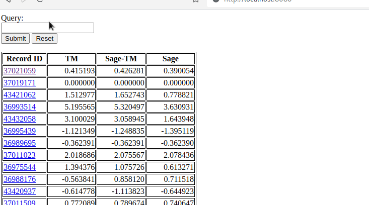

# entomon
debugging force field benchmark results

## Demo
In the demo below, you can see the generation of SVGs corresponding to QCArchive
record IDs.

## Queries
The program supports queries written in JavaScript, with some shortcuts for
writing short queries. For example, the query `|$1| > 50` expands into
`Math.abs(vals[1]) > 50`. And `|$1 - $3| > 12 && |$1 - $2| < 1` expands into
`Math.abs(vals[1] - vals[3]) > 12 && Math.abs(vals[1] - vals[2]) < 1`. `vals` is
the internal name for the table columns, so it's preferable to use the `$N`
form. Anything inside pairs of pipes is put inside of a `Math.abs`.
